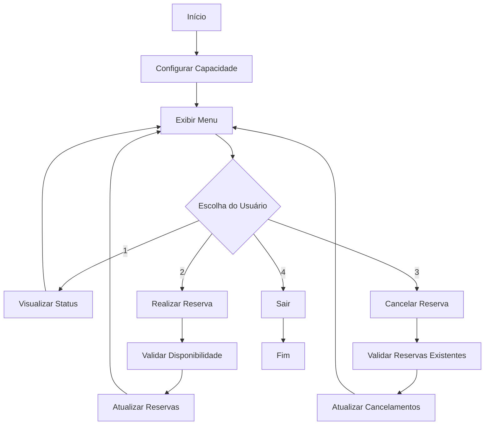

# Sistema de Reservas para Eventos


Sistema interativo desenvolvido em Python para gerenciamento de reservas de eventos com capacidade limitada, demonstrando conceitos fundamentais de Programação Orientada a Objetos.

## Descrição do Projeto

Este projeto foi desenvolvido como exercício de **Programação Orientada a Objetos** em Python. O sistema simula o gerenciamento de reservas para eventos, permitindo reservar lugares, cancelar reservas e visualizar a disponibilidade em tempo real.

### Problema Resolvido
- **Cenário:** Necessidade de controlar reservas em eventos com capacidade limitada
- **Solução:** Sistema orientado a objetos com validações e interface interativa
- **Resultado:** Controle eficiente de ocupação e disponibilidade de lugares

## Funcionalidades

### Gerenciamento de Eventos
- **Configuração Inicial:** Define capacidade total do evento
- **Validação de Capacidade:** Aceita apenas valores positivos
- **Status em Tempo Real:** Acompanha ocupação atual

### Sistema de Reservas
- **Reserva de Lugares:** Permite reservar múltiplos lugares simultaneamente
- **Validação de Disponibilidade:** Impede reservas acima da capacidade
- **Confirmação Visual:** Exibe status atualizado após cada operação

### Sistema de Cancelamentos
- **Cancelamento Flexível:** Permite cancelar quantidade específica de reservas
- **Validação de Existência:** Impede cancelamentos sem reservas existentes
- **Atualização Automática:** Recalcula disponibilidade instantaneamente

### Interface e Controles
- **Menu Interativo:** 4 opções principais numeradas
- **Validação Robusta:** Trata entradas inválidas e não numéricas
- **Feedback Visual:** Títulos formatados e separadores visuais
- **Navegação Intuitiva:** Loop contínuo até escolha de saída

## Tecnologias Utilizadas

- **Python 3.x**
- **Programação Orientada a Objetos:** Classes, métodos, encapsulamento
- **Estruturas de Controle:** `while`, `if/elif/else`
- **Tratamento de Exceções:** `try/except ValueError`
- **Métodos de String:** `.upper()`, formatação com f-strings
- **Validação de Entrada:** Loops de verificação

## Como Executar

### Pré-requisitos
- Python 3.6 ou superior instalado no sistema

### Instalação e Execução
1. **Clone o repositório:**
   ```bash
   git clone https://github.com/seu-usuario/sistema-reservas-eventos.git
   cd sistema-reservas-eventos
   ```

2. **Execute o programa:**
   ```bash
   python sistema_reservas.py
   ```

3. **Siga as instruções:**
   - Configure a capacidade do evento
   - Navegue pelo menu principal
   - Realize operações de reserva/cancelamento

## Demonstração do Sistema

### Tela Inicial
```
────────────────────────────────────────────────────────────────────────────────────────────────────
                                        CONFIGURAÇÃO DO EVENTO
────────────────────────────────────────────────────────────────────────────────────────────────────

Insira a capacidade total do evento: 50
Evento criado com sucesso! Capacidade: 50 lugares
```

### Menu Principal
```
────────────────────────────────────────────────────────────────────────────────────────────────────
                                           MENU PRINCIPAL
────────────────────────────────────────────────────────────────────────────────────────────────────

Opções disponíveis:
  1. Visualizar status do evento
  2. Realizar reserva
  3. Cancelar reserva
  4. Sair do sistema
```

### Processo de Reserva
```
────────────────────────────────────────────────────────────────────────────────────────────────────
                                         STATUS DO EVENTO
────────────────────────────────────────────────────────────────────────────────────────────────────

O evento possui 50 lugares totais:
 - Reservados: 15
 - Disponíveis: 35

Digite a quantidade de pessoas para reservar lugar: 10
Reserva efetuada com sucesso!
 - Reservado: 25
 - Disponíveis: 25
```

## Estrutura do Código

### Arquivo Principal
- **`sistema_reservas.py`** - Implementação completa do sistema

### Classe Principal
```python
class Evento:
    def __init__(capacidade, reservado)    # Construtor da classe
    def reservar()                         # Sistema de reservas
    def cancelar()                         # Sistema de cancelamentos  
    def lugares_disponiveis()              # Exibição de status
```

### Funções Auxiliares
```python
def imprimir_titulo(titulo)              # Formatação visual
def menu()                               # Interface do usuário
def definindo_lugares()                  # Configuração inicial
def definindo_escolha()                  # Validação de menu
def main()                               # Programa principal
```

## Fluxo de Funcionamento



## Conceitos Demonstrados

### Programação Orientada a Objetos
- **Encapsulamento:** Dados e comportamentos organizados em classe
- **Métodos de Instância:** Operações que modificam estado do objeto
- **Construtor:** Inicialização controlada de objetos

### Validação e Controle de Fluxo
- **Loops de Validação:** Repetição até entrada válida
- **Estruturas Condicionais:** Tomada de decisões baseada em estado
- **Tratamento de Exceções:** Captura de erros de entrada

### Interface de Usuario
- **Menu Interativo:** Navegação numerada intuitiva
- **Feedback Visual:** Confirmações e mensagens informativas
- **Formatação Consistente:** Títulos e separadores padronizados

## Casos de Teste

| Cenário | Entrada | Resultado Esperado |
|---------|---------|-------------------|
| Evento Novo | Capacidade: 10 | 10 lugares disponíveis |
| Reserva Válida | 5 pessoas | 5 reservados, 5 disponíveis |
| Reserva Excessiva | 15 pessoas | Erro: quantidade maior que disponível |
| Cancelamento Válido | 3 pessoas | 2 reservados, 8 disponíveis |
| Cancelamento Excessivo | 10 pessoas | Erro: quantidade maior que reservado |

## Validações Implementadas

- **Capacidade Positiva:** Evento deve ter pelo menos 1 lugar
- **Entrada Numérica:** Aceita apenas números inteiros
- **Quantidade Positiva:** Reservas/cancelamentos devem ser > 0
- **Disponibilidade:** Reservas não podem exceder vagas livres
- **Existência de Reservas:** Cancelamentos só se houver reservas

## Aprendizados Aplicados

Este projeto consolidou conhecimentos em:
- **Classes e Objetos:** Modelagem de entidades do mundo real
- **Métodos e Atributos:** Encapsulamento de dados e comportamentos  
- **Validação de Entrada:** Técnicas para entrada robusta de dados
- **Estruturas de Controle:** Loops e condicionais para fluxo de programa
- **Interface de Terminal:** Criação de menus interativos funcionais
- **Tratamento de Erros:** Prevenção de crashes por entrada inválida

## Melhorias Futuras

- [ ] Persistência de dados em arquivo
- [ ] Sistema de identificação de reservas
- [ ] Relatórios de ocupação por período
- [ ] Interface gráfica com Tkinter
- [ ] Múltiplos eventos simultâneos
- [ ] Sistema de filas de espera
- [ ] Integração com banco de dados
- [ ] API REST para integração externa

## Estrutura de Arquivos

```
sistema-reservas-eventos/
│
├── sistema_reservas.py      # Código principal
├── README.md               # Documentação
└── requirements.txt        # Dependências (futuro)
```

## Contribuições

Contribuições são bem-vindas! Para contribuir:

1. Faça um fork do projeto
2. Crie uma branch para sua feature (`git checkout -b feature/nova-feature`)
3. Commit suas mudanças (`git commit -m 'Adiciona nova feature'`)
4. Push para a branch (`git push origin feature/nova-feature`)
5. Abra um Pull Request

## Licença

Este projeto está sob a licença MIT. Veja o arquivo `LICENSE` para mais detalhes.

## Contato

**Natan Mauricio Santos**
- Email: natanmauriciosantos@hotmail.com
- LinkedIn: linkedin.com/in/natan-mauricio-santos
- GitHub: github.com/NatanMauricio1995

---

*Desenvolvido como exercício de Programação Orientada a Objetos em Python*
